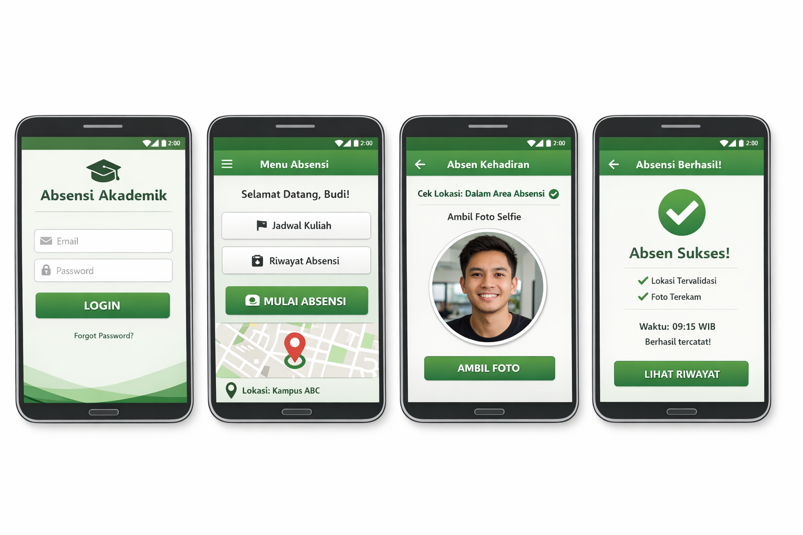

# 📱 Aplikasi Absensi Akademik Berbasis Koordinat dan Foto (Mobile)

## 📌 Deskripsi Proyek
Proyek ini merupakan **Tugas Project Akhir Mata Kuliah Pemrograman Mobile** yang bertujuan untuk membangun **aplikasi akademik berbasis mobile** dengan fokus pada **fitur absensi menggunakan data koordinat (GPS) dan pengambilan foto mahasiswa**.

Aplikasi ini dirancang untuk meningkatkan **validitas kehadiran mahasiswa**, dengan memastikan bahwa absensi hanya dapat dilakukan apabila mahasiswa:
1. Berada pada **lokasi yang telah ditentukan**, dan
2. Melakukan **pengambilan foto (selfie) secara langsung saat absensi**

---

## 🎯 Tujuan Proyek
- Mengimplementasikan **Location-Based Service (LBS)** pada aplikasi mobile
- Mengintegrasikan **kamera perangkat** untuk dokumentasi absensi
- Mencegah kecurangan absensi (titip absen)
- Mengembangkan aplikasi mobile akademik berbasis Android
- Melatih kemampuan perancangan dan implementasi aplikasi mobile

---

## 🚀 Fitur Utama
- 🔐 **Login Pengguna (Mahasiswa)**
- 📍 **Pengambilan Koordinat Lokasi (Latitude & Longitude)**
- 🏫 **Validasi Lokasi Absensi (Radius Area)**
- 📸 **Pengambilan Foto Mahasiswa Saat Absensi**
- 🕒 **Pencatatan Waktu Absensi**
- 📄 **Riwayat Kehadiran Mahasiswa**
- ⚠️ **Notifikasi Absensi Ditolak jika Tidak Valid**

---

## 🗺️ Mekanisme Absensi Berbasis Lokasi dan Foto
1. Mahasiswa melakukan **login**
2. Memilih menu **Absensi**
3. Sistem meminta:
    - Izin **akses lokasi**
    - Izin **akses kamera**
4. Aplikasi mengambil:
    - 📍 **Koordinat lokasi mahasiswa**
    - 📸 **Foto mahasiswa secara real-time**
5. Sistem melakukan validasi:
    - Lokasi berada dalam **radius absensi**
    - Foto berhasil diambil
6. Jika valid → **Absensi berhasil**
7. Jika tidak valid → **Absensi ditolak**

---

## 📸 Pengambilan Foto Saat Absensi
- Foto diambil menggunakan **kamera depan (selfie)**
- Foto hanya dapat diambil **saat proses absensi**
- Foto disimpan sebagai **bukti kehadiran**
- Foto dapat digunakan untuk:
    - Verifikasi manual oleh dosen
    - Dokumentasi akademik

---

## 🛠️ Teknologi yang Digunakan
- **Platform** : Android
- **Bahasa Pemrograman** : Kotlin / Java
- **Location Service** :
    - Google Maps API
    - Fused Location Provider
- **Camera API** : CameraX / Camera2
- **Database** : Firebase / SQLite / MySQL
- **Storage** : Firebase Storage / Local Storage
- **IDE** : Android Studio

---

## 🔐 Izin Aplikasi (Permissions)
Aplikasi memerlukan izin berikut:
- `ACCESS_FINE_LOCATION`
- `ACCESS_COARSE_LOCATION`
- `CAMERA`
- `INTERNET`
- `WRITE_EXTERNAL_STORAGE` (jika diperlukan)

---

## 📂 Mockup

## Catatan:
Kembangkan project dari starter yang sudah disediakan, tidak membuat dari awal.

## Pengecekan:
- https://ntfy.ubharajaya.ac.id/EAS
- https://docs.google.com/spreadsheets/d/1jH15MfnNgpPGuGeid0hYfY7fFUHCEFbCmg8afTyyLZs/edit?gid=0#gid=0